# CogniFlow High-Level Design (HLD)

This document provides a comprehensive architectural overview of CogniFlow, including system design, component interactions, data flow, and technical decisions.

## 🏗️ System Architecture

### Overview

CogniFlow is a modern full-stack application built with a microservices-oriented architecture, designed for scalability, maintainability, and performance.

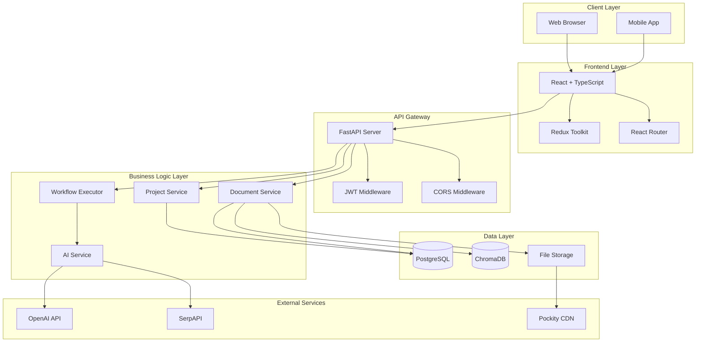

## 🧱 Component Architecture

### Frontend Architecture

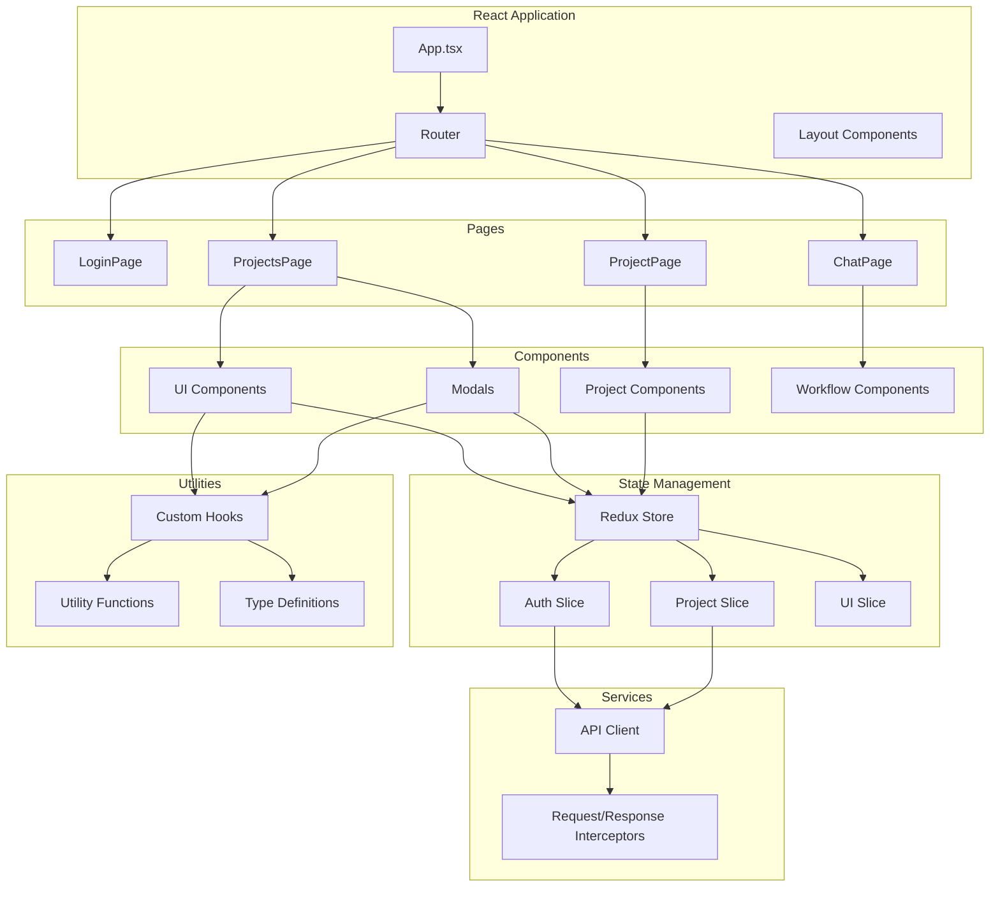

### Backend Architecture

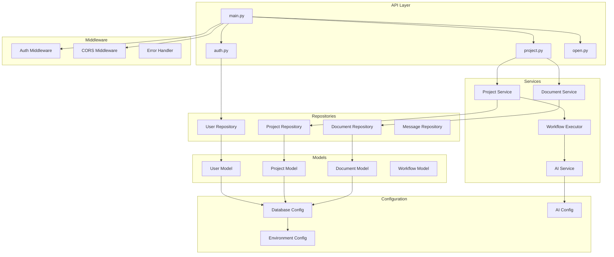

## 📊 Data Flow Architecture

### User Authentication Flow

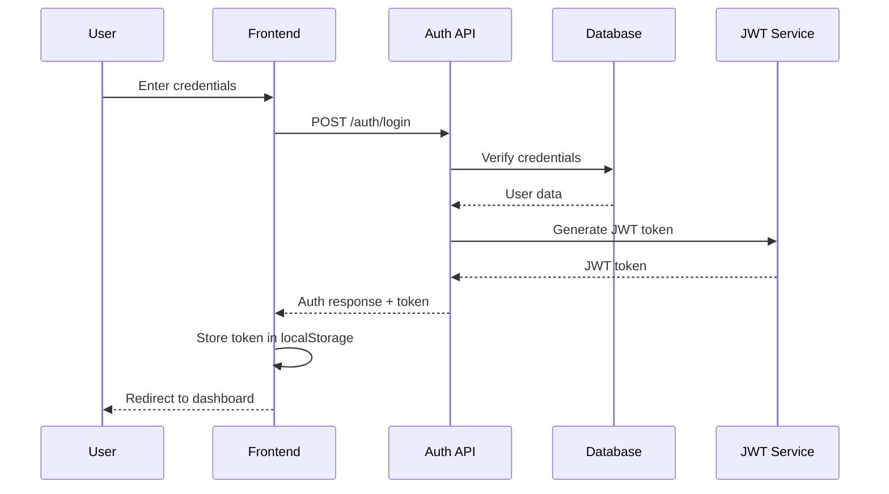

### Project Creation Flow

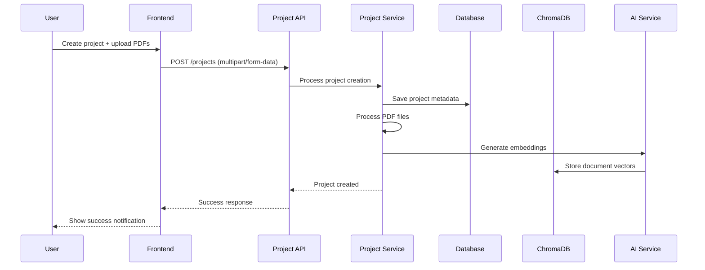

### AI Query Processing Flow

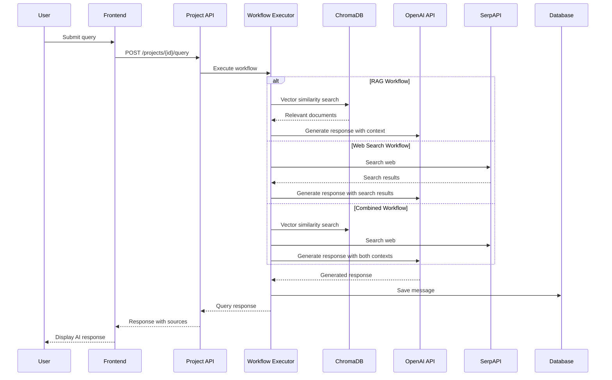

## 🗄️ Database Design

### Entity Relationship Diagram

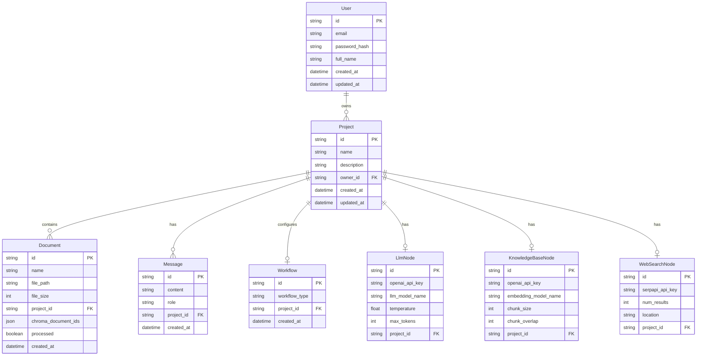

### Data Storage Strategy

#### PostgreSQL (Primary Database)

- **User data**: Authentication, profiles, settings
- **Project metadata**: Names, descriptions, ownership
- **Document metadata**: File info, processing status
- **Message history**: Chat conversations
- **Workflow configurations**: Node settings, API keys

#### ChromaDB (Vector Database)

- **Document embeddings**: Vector representations of text chunks
- **Similarity search**: Fast retrieval of relevant content
- **Metadata storage**: Document references, chunk positions

#### File Storage

- **PDF files**: Original uploaded documents
- **Processed text**: Extracted and chunked content
- **Temporary files**: Upload processing

## 🔄 Workflow Engine Design

### Workflow Types

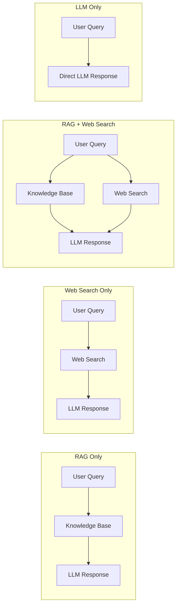

### Workflow Execution Engine

```python
class WorkflowExecutor:
    async def execute(self, workflow_type: str, query: str, context: dict) -> dict:
        execution_log = []
        sources = []

        if workflow_type in ["rag_only", "rag_with_web_search"]:
            # Knowledge base search
            kb_results = await self.search_knowledge_base(query, context)
            sources.extend(kb_results["sources"])
            execution_log.append({
                "node": "knowledge_base",
                "status": "success",
                "results_count": len(kb_results["documents"])
            })

        if workflow_type in ["web_search_only", "rag_with_web_search"]:
            # Web search
            web_results = await self.search_web(query, context)
            sources.extend(web_results["sources"])
            execution_log.append({
                "node": "web_search",
                "status": "success",
                "results_count": len(web_results["results"])
            })

        # Generate LLM response
        llm_response = await self.generate_response(query, sources, context)
        execution_log.append({
            "node": "llm",
            "status": "success",
            "token_count": llm_response["usage"]["total_tokens"]
        })

        return {
            "response_text": llm_response["content"],
            "execution_log": execution_log,
            "retrieved_sources": sources
        }
```

## 🔒 Security Architecture

### Authentication & Authorization

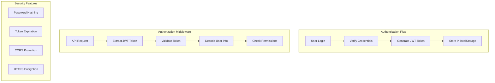

### Security Measures

#### Backend Security

- **JWT Authentication**: Stateless token-based auth
- **Password Hashing**: bcrypt for secure password storage
- **Input Validation**: Pydantic models for request validation
- **SQL Injection Protection**: SQLAlchemy ORM with parameterized queries
- **CORS Configuration**: Controlled cross-origin access
- **Rate Limiting**: API endpoint protection (planned)

#### Frontend Security

- **Token Storage**: JWT tokens in localStorage (consider httpOnly cookies for production)
- **Auto-logout**: Token expiration handling
- **Protected Routes**: Route-level authentication checks
- **Input Sanitization**: Form validation and sanitization
- **HTTPS Enforcement**: Secure communication in production

#### Data Security

- **API Key Encryption**: User API keys encrypted at rest
- **File Upload Validation**: File type and size restrictions
- **Access Control**: User-based resource isolation
- **Audit Logging**: User action tracking (planned)

## 🚀 Performance Architecture

### Frontend Performance

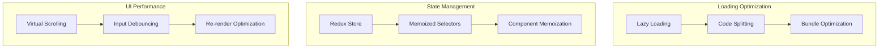

#### Optimization Strategies

- **Code Splitting**: Route-based lazy loading
- **Bundle Optimization**: Tree shaking and minification
- **Memoization**: React.memo and useMemo for expensive operations
- **Virtual Scrolling**: Efficient rendering of large lists
- **Debounced Inputs**: Reduced API calls for search/filter operations

### Backend Performance

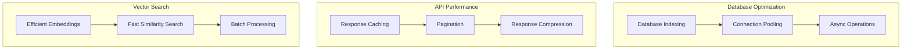

#### Optimization Strategies

- **Async/Await**: Non-blocking I/O operations
- **Database Indexing**: Optimized query performance
- **Connection Pooling**: Efficient database connections
- **Vector Search Optimization**: ChromaDB indexing and caching
- **Response Compression**: Reduced payload sizes
- **Pagination**: Controlled data loading

### Caching Strategy

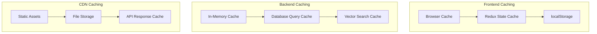

## 📈 Scalability Design

### Horizontal Scaling

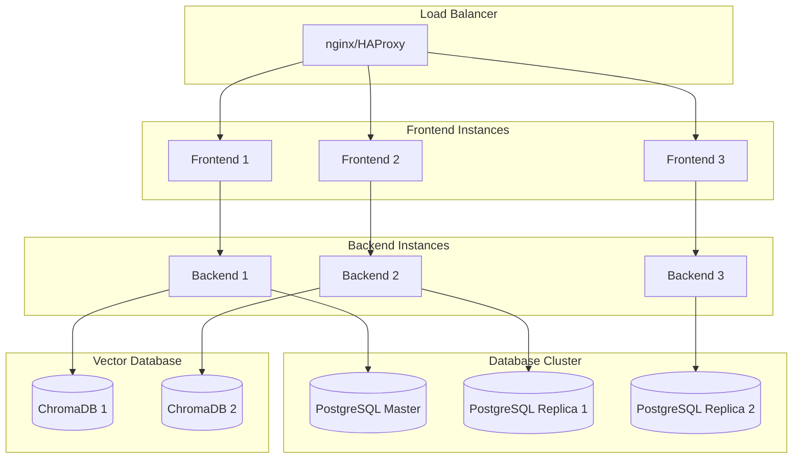

### Microservices Architecture (Future)

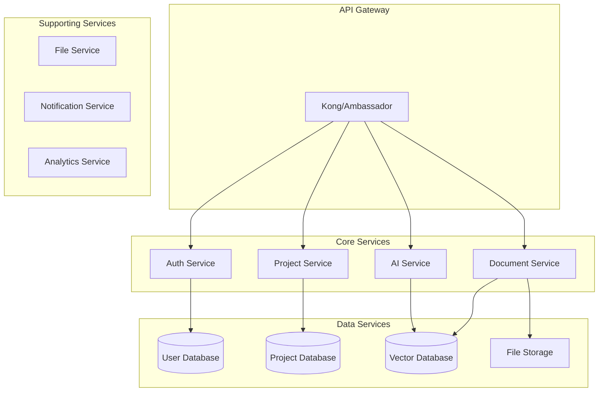

## 🔍 Monitoring & Observability

### Logging Architecture

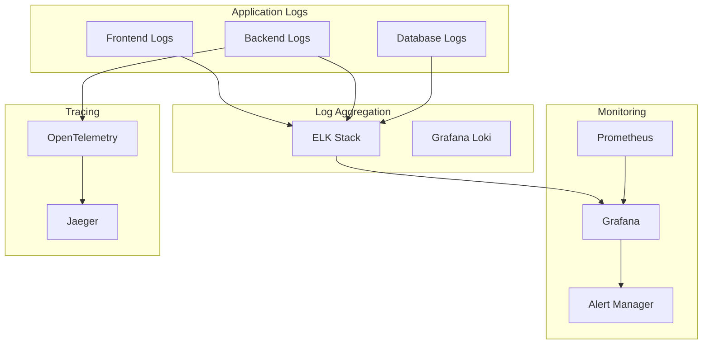

### Metrics & KPIs

#### Technical Metrics

- **Response Time**: API endpoint latency
- **Throughput**: Requests per second
- **Error Rate**: 4xx/5xx error percentage
- **Database Performance**: Query execution time
- **Memory Usage**: Application memory consumption
- **CPU Utilization**: Server resource usage

#### Business Metrics

- **User Activity**: Daily/monthly active users
- **Project Creation**: New projects per day
- **Document Processing**: Files processed per hour
- **Query Volume**: AI queries per user
- **Feature Usage**: Workflow type distribution

## 🚀 Deployment Architecture

### CI/CD Pipeline

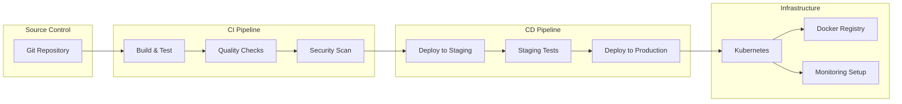

## 🔮 Future Enhancements

### Planned Features

- **Multi-tenant Architecture**: Support for organizations
- **Advanced Analytics**: Usage dashboards and insights
- **API Marketplace**: Third-party integrations
- **Mobile Application**: Native iOS/Android apps
- **Advanced Workflows**: Visual workflow builder
- **Real-time Collaboration**: Multi-user project editing
- **Enterprise Features**: SSO, advanced security, compliance

### Technical Improvements

- **GraphQL API**: More flexible data fetching
- **Event-Driven Architecture**: Async processing
- **Advanced Caching**: Redis-based caching layer
- **ML Pipeline**: Custom model training and deployment
- **Edge Computing**: CDN-based processing
- **Blockchain Integration**: Document verification and provenance

## 📋 Technical Decisions

### Framework Choices

#### Frontend: React + TypeScript

**Rationale**:

- Strong ecosystem and community support
- Excellent TypeScript integration
- Rich component library ecosystem
- Good performance with modern React features

#### Backend: FastAPI + Python

**Rationale**:

- High performance async capabilities
- Excellent OpenAPI documentation generation
- Strong Python AI/ML ecosystem integration
- Type hints and validation built-in

#### Database: PostgreSQL + ChromaDB

**Rationale**:

- PostgreSQL: ACID compliance, JSON support, strong ecosystem
- ChromaDB: Optimized for vector operations, easy Python integration
- Separation of concerns: relational data vs. vector data

### Design Patterns

#### Frontend Patterns

- **Redux Toolkit**: Simplified state management
- **Custom Hooks**: Logic reusability
- **Compound Components**: Flexible component APIs
- **Error Boundaries**: Graceful error handling

#### Backend Patterns

- **Repository Pattern**: Data access abstraction
- **Service Layer**: Business logic separation
- **Dependency Injection**: Testable, modular code
- **Strategy Pattern**: Workflow execution flexibility
